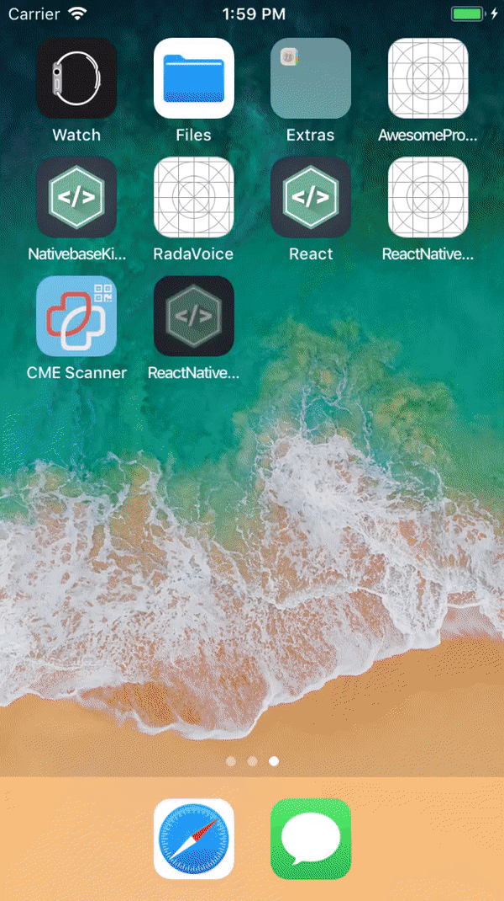

# React Native Redux Starter Kit

A starter boilerplate for a mobile app using React Native and Redux.

[](https://david-dm.org/daviddang91/react-native-redux-starter-kit)
[](https://david-dm.org/daviddang91/react-native-redux-starter-kit#info=devDependencies)

## Demo (Account: demo@gmail.com / 123456)



## Requirements
- [Node](https://nodejs.org) `6.x` or newer
- [React Native](http://facebook.github.io/react-native/docs/getting-started.html) for development
- [Xcode](https://developer.apple.com/xcode/) for iOS development
- [Android Studio](https://developer.android.com/studio/index.html) for Android development
- [Android SDK](https://developer.android.com/sdk/) `23.0.1` or newer for Android development
- [Genymotion](https://www.genymotion.com/) for Android emulation
- [Android Marshmallow](https://www.android.com/versions/marshmallow-6-0/) or newer on your Android device to test properly

See [Getting Started](https://facebook.github.io/react-native/docs/getting-started.html) to install requirement tools.

## Stack
- [React JS](https://reactjs.org/) is a JavaScript library
- [React Native](https://facebook.github.io/react-native/) `0.56.0` for building native apps using react
- [Redux](https://redux.js.org) `4.0.0` a predictable state container for Javascript apps
- [Babel](http://babeljs.io/) `7.2.3` for ES6+ support
- [NativeBase](https://nativebase.io/) `2.7.2` a UI components for React Native
- [Immutable](https://facebook.github.io/immutable-js/) Immutable persistent data collections for Javascript
- [Navigation for React Native](https://reactnavigation.org/) a router based on new React Native Navigation API


## Libraries
- [native-base](https://nativebase.io/) `2.7.2`
- [react-native-qrcode-scanner](https://github.com/daviddang91/react-native-qrcode-scanner) `1.0.1`
- [react-native-camera](https://github.com/react-native-community/react-native-camera) `1.1.4`
- [react-native-splash-screen](https://github.com/crazycodeboy/react-native-splash-screen) `3.1.1`
- [react-native-loading-spinner-overlay](https://github.com/joinspontaneous/react-native-loading-spinner-overlay) `0.5.2`

## Get Started


#### 1. Installation

On the command prompt run the following commands

```sh
$ git clone git@github.com:daviddang91/react-native-redux-starter-kit.git

$ cd react-native-redux-starter-kit/

$ npm install
```

#### 2. Simulate for iOS

**Method One**

*	Open the project in Xcode from **ios/ReactNativeStarter.xcodeproj**.

*	Hit the play button.


**Method Two**

*	Run the following command in your terminal.

```sh
$ react-native run-ios
```

#### 3. Simulate for Android

*	Make sure you have an **Android emulator** installed and running.

*	Run the following command in your terminal.

```sh
$ react-native run-android
```

## Setup ES6+Babel+JSX Linting with Atom/Nuclide

This sets up Atom to properly lint ES6+Babel+JSX using Airbnb's .eslintrc as a starting point.

## Steps

1. Download [Atom](https://atom.io/) and get these two packages: [Linter](https://atom.io/packages/linter) and [Linter-ESLint](https://atom.io/packages/linter-eslint)
2. Run `npm i -D eslint eslint-config-airbnb babel-eslint eslint-plugin-babel eslint-plugin-react eslint-plugin-react-native eslint-plugin-import eslint-plugin-jsx-a11y` from your project root.
3. Add `"extends": "airbnb"` to your .eslintrc and `"plugins": [ "babel", "react", "react-native", "jsx-a11y" ]`
4. Run `apm install linter-eslint` this also installs `linter` which clashes with nuclide diagnostics
5. Run `apm disable linter` to stop the linter clashing with nuclide

See [Airbnb's Javascript styleguide](https://github.com/airbnb/javascript) and
the [ESlint config docs](http://eslint.org/docs/user-guide/configuring#extending-configuration-files)
for more information.

## Data Persistence
- [redux-persist](https://github.com/rt2zz/redux-persist) `5.10.0` persist and rehydrate a redux store


## Debugger
- [React Native Debugger](https://github.com/jhen0409/react-native-debugger) : The standalone app based on official debugger of React Native, and includes React Inspector / Redux DevTools
- [redux-devtools-extension](https://github.com/zalmoxisus/redux-devtools-extension) `2.13.5`

## Rename Project
Rename react-native app with just one command


> This package assumes that you created your react-native project using `react-native init`.

#### Installation
```
yarn global add react-native-rename
or
npm install react-native-rename -g
```

Switch to new branch first
>better to have back-up

```
git checkout -b rename-app
```

#### Usage
```
react-native-rename <newName>
```

> With custom Bundle Identifier (Android)
```
react-native-rename <newName> -b <bundleIdentifier>
```

#### Example
```
react-native-rename "Travel App"
```
> With custom Bundle Identifier
```
react-native-rename "Travel App" -b com.junedomingo.travelapp
```

